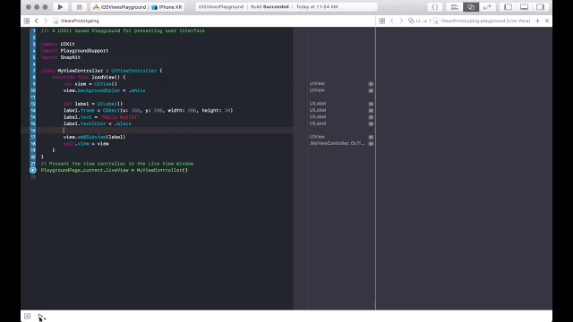
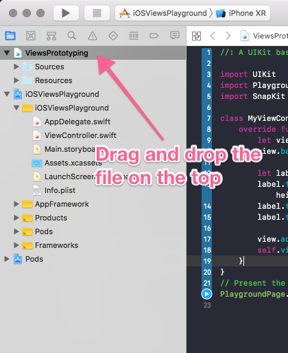
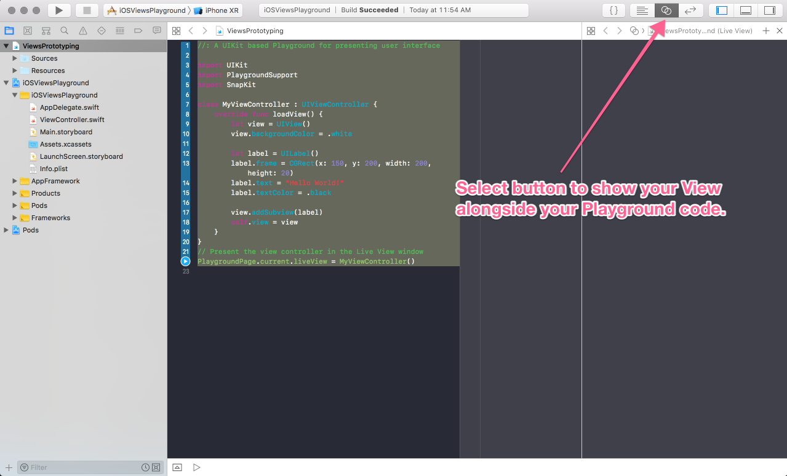

# iOSViewsPlayground

XCode Playground used to quickly prototype iOS views. 

# What is iOSViewsPlayground?

XCode Playgrounds are a convenient way to "play" with new ideas. They simply allow you to write code, compile and run it within seconds instead of the traditional: Build, run, repeat cycle that takes much more time with a traditional XCode project. 



I use SnapKit to build the UI of my iOS apps in code. Creating a perfect UI for my app takes time because each time I make a small tweak I need to build and run my whole XCode project which can take 30 seconds or so to do. It would be nice if I could use the speed of XCode Playgrounds to build my UI and then be able to quickly and easily be able to use that View in my project...

...well, you can with iOSViewsPlayground. 

* Download this project.
* Open up the workspace in XCode. 
* Open the Playground file and do your prototyping. 
* When you are happy with your prototype, copy and paste it 

*Note:* iOSViewsPlayground is nothing special. I do not do any magic to get this to work. This is simply a project that I already have setup to show off how this can be done. 

# How did you do this?

Pretty simple. I just took an existing XCode project (or workspace if you use CocoaPods) that I created. Then I followed these steps:

* Open your project (or workspace if you use CocoaPods) in XCode. 
* Go to `File > New > Playground`. Name it whatever you want and save it into the root directory of your project. 
* Close the Playground editor that XCode opens automatically for you. 
* Drag and drop the Playground file in your root directory that you just created and drag it into your XCode project navigator at the very top like this:



* Build your XCode project. 
* You may now select the Playground from the project navigator in XCode, edit it, build and run it (from the play button in the bottom left side of the screen in XCode 10), and then copy/paste the code once you are happy with it! 

# The Playground file does not show my view?!

* Here is a basic Playground file that is designed to create and show a `UIViewController` that you can prototype:

```swift
//: A UIKit based Playground for presenting user interface
  
import UIKit
import PlaygroundSupport

class MyViewController : UIViewController {
    override func loadView() {
        let view = UIView()
        view.backgroundColor = .white

        let label = UILabel()
        label.frame = CGRect(x: 150, y: 200, width: 200, height: 20)
        label.text = "Hello World!"
        label.textColor = .black
        
        view.addSubview(label)
        self.view = view
    }
}
// Present the view controller in the Live View window
PlaygroundPage.current.liveView = MyViewController()
```

* Open the visual editor to view your compiled Playground view and view it:



## Author

* Levi Bostian - [GitHub](https://github.com/levibostian), [Twitter](https://twitter.com/levibostian), [Website/blog](http://levibostian.com)


## Contribute

Did you have troubles using this project? Is it out-of-date with the newest version of Swift, CocoaPods, or XCode? Issues and pull requests are welcome!